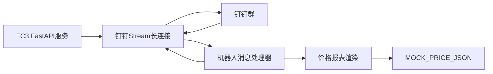

# 架构说明

## 架构

## 模块

- `agent/main.py`：FastAPI 单入口，提供 `/health`，并在服务启动时启动钉钉 Stream 客户端。
- `PriceBotStreamHandler`：处理钉钉机器人消息并回复 Markdown。
- `MOCK_PRICE_JSON`：首版结构化假数据，后续可替换为数据库或真实价格源。
- `render_price_markdown`：将结构化数据渲染为钉钉 Markdown。
- `s.yaml`：FC3 自定义运行时部署配置。
- `.github/workflows/deploy.yml`：GitHub Actions CI/CD，push 后语法检查并部署。

## 环境变量

- `PORT`：服务端口，FC3 使用 `9000`。
- `BOT_TITLE`：Markdown 标题，默认“污水处理药剂价格早报”。
- `DINGTALK_CLIENT_ID`：钉钉应用 Client ID，旧版应用通常是 AppKey。
- `DINGTALK_CLIENT_SECRET`：钉钉应用 Client Secret，旧版应用通常是 AppSecret。

FC3 部署地域固定为华东 1（杭州）：`cn-hangzhou`。

## 安全原则

- 钉钉 Client Secret、阿里云 AccessKey 只放在 FC 环境变量或 GitHub Actions Secrets。
- 不在代码、文档示例或前端中硬编码真实密钥。
- GitHub Actions 使用 RAM 子账号 AccessKey，权限限制到目标 FC3 资源。
- Stream 模式通过 SDK 建立鉴权长连接，不再暴露钉钉消息 HTTP 回调地址。
- FC 需要至少一个常驻/预留实例保持长连接，否则空闲回收后机器人会离线。

## 扩展点

- 将 `MOCK_PRICE_JSON` 替换为数据库查询。
- 根据钉钉消息关键词返回不同 Markdown。
- 增加数据来源、更新时间、异常兜底提示。
- 增加定时采集任务或人工维护后台。
