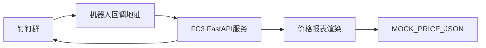

# 架构说明

## 架构

## 模块

- `agent/main.py`：FastAPI 单入口，提供 `/health` 和 `/api/dingtalk/price-bot`。
- `MOCK_PRICE_JSON`：首版结构化假数据，后续可替换为数据库或真实价格源。
- `render_price_markdown`：将结构化数据渲染为钉钉 Markdown。
- `s.yaml`：FC3 自定义运行时部署配置。
- `.github/workflows/deploy.yml`：GitHub Actions CI/CD，push 后测试并部署。

## 环境变量

- `PORT`：服务端口，FC3 使用 `9000`。
- `BOT_TITLE`：Markdown 标题，默认“污水处理药剂价格早报”。
- `DINGTALK_BOT_SECRET`：钉钉机器人加签密钥。
- `DINGTALK_ENABLE_SIGN_CHECK`：是否启用签名校验，首版联调建议先设为 `false`。
- `ALIBABA_CLOUD_REGION`：FC3 地域，例如 `cn-hangzhou`。
- `FC_SERVICE_NAME`：可选，FC 服务名。
- `FC_FUNCTION_NAME`：可选，FC 函数名。

## 安全原则

- 钉钉密钥、阿里云 AccessKey 只放在 FC 环境变量或 GitHub Actions Secrets。
- 不在代码、文档示例或前端中硬编码真实密钥。
- GitHub Actions 使用 RAM 子账号 AccessKey，权限限制到目标 FC3 资源。
- 签名校验开启后，服务会校验 `timestamp` 和 `sign`，并拒绝过期请求。

## 扩展点

- 将 `MOCK_PRICE_JSON` 替换为数据库查询。
- 根据钉钉消息关键词返回不同 Markdown。
- 增加数据来源、更新时间、异常兜底提示。
- 增加定时采集任务或人工维护后台。
